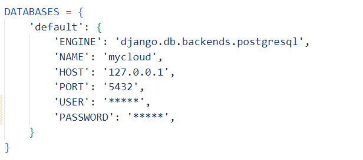

# ☁️ MyCloud - приложение для хранения данных

## Запуск приложения

1. Установка зависимостей
```
pip install -r requirements.txt
```

2. Установка базы данных (для СУБД Postgres)
```
createdb -U postgres mycloud
```
```
pip install psycopg2-binary
```
```
python manage.py migrate
```
* Изменить в Settings.py DATABASES при необходимости HOST, PORT, USER, PASSWORD



3. Установка базы данных (для СУБД SQLite)
```
python manage.py migrate
```

3. Установка пакетов
```
cd frontend
```
```
npm i -D 
```

4. Запустить локальный сервер
```
python manage.py runserver
```